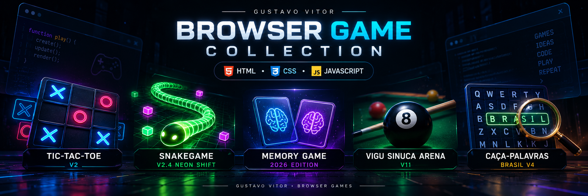
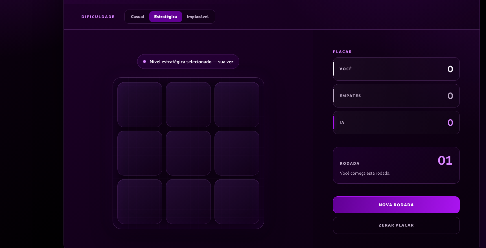
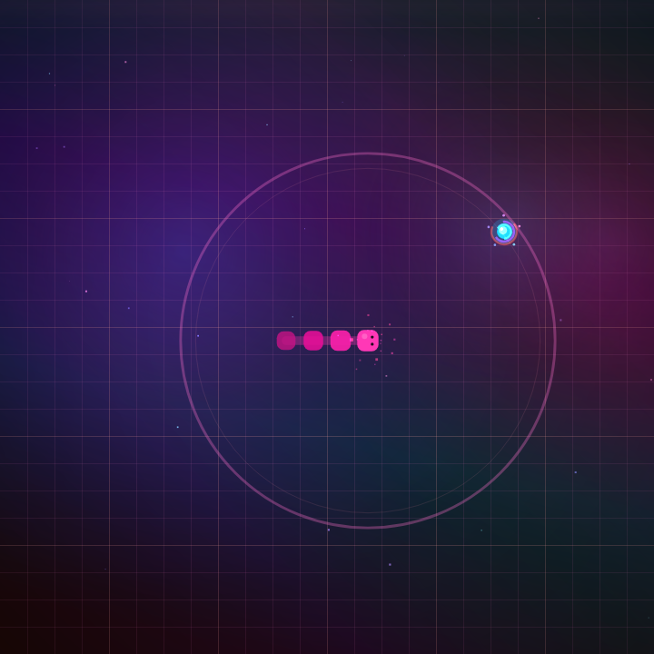
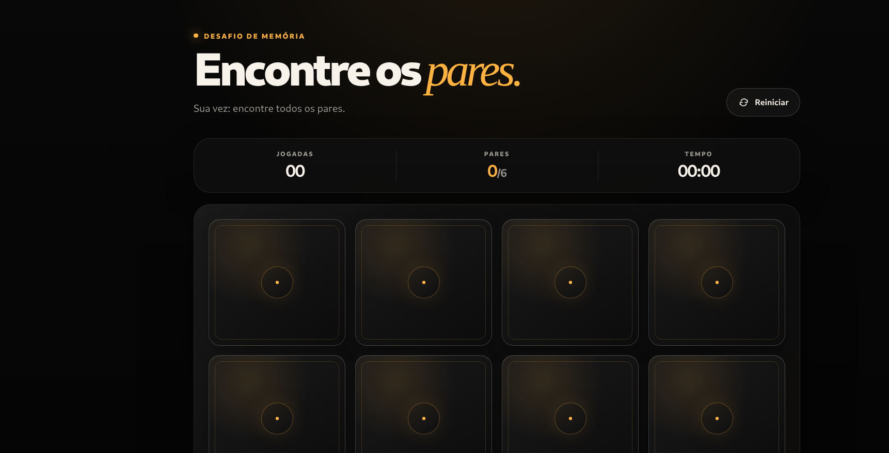
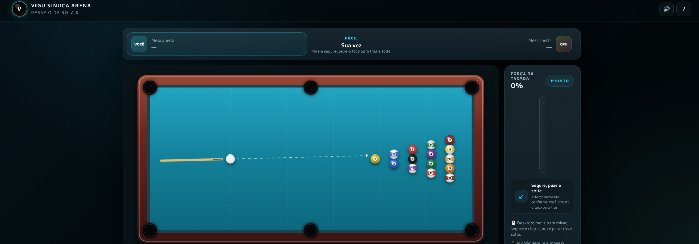
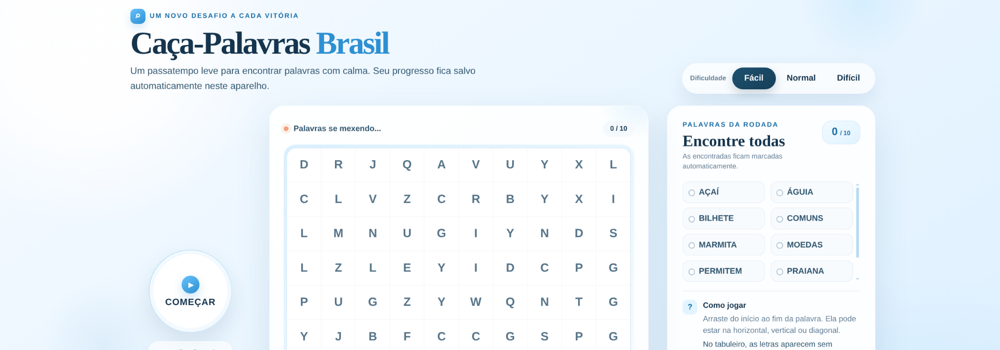
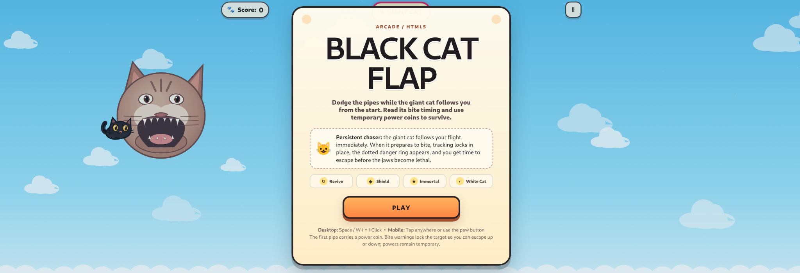
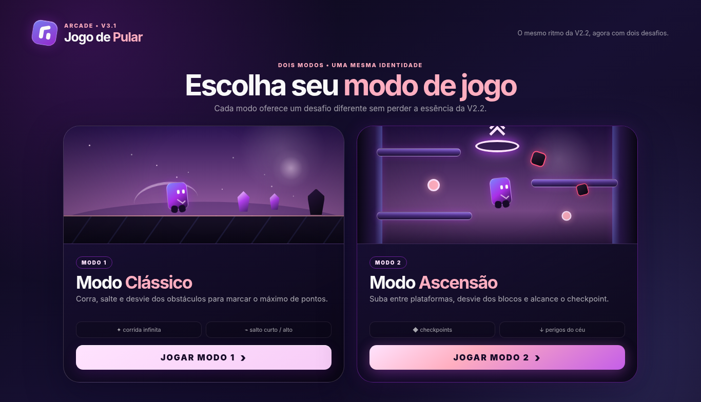

<div align="center">



<br>
<br>

# 🎮 Games Made with HTML, CSS and JavaScript

### A central hub for my browser game projects

A curated collection of browser games built with **HTML5**, **CSS3** and **Vanilla JavaScript**.

Each project has its own repository, visual identity and playable deployment. This repository works as a central showcase for the latest versions of my games.

<br>


<br>

**8 projects • Static deploys • Play directly in the browser**

</div>

---

## 🚀 Quick Access

| Project | Current Version | Repository | Deploy |
|:--|:--:|:--:|:--:|
| ❌⭕ **Tic-Tac-Toe** | **V2** | [Open Repository](https://github.com/GustavoVitorS/Jogo-Da-Velha) | [Open Deploy](https://gustavovitors.github.io/Jogo-Da-Velha/) |
| 🐍 **SnakeGame — Neon Shift** | **V2.4** | [Open Repository](https://github.com/GustavoVitorS/SnakeGame) | [Open Deploy](https://gustavovitors.github.io/SnakeGame/) |
| 🧠 **Memory Game** | **2026 Edition** | [Open Repository](https://github.com/GustavoVitorS/Memory-Game) | [Open Deploy](https://gustavovitors.github.io/Memory-Game/) |
| 🎱 **VIGU Sinuca Arena** | **V11** | [Open Repository](https://github.com/GustavoVitorS/vigu-sinuca-arena) | [Open Deploy](https://gustavovitors.github.io/vigu-sinuca-arena/) |
| 🔎 **Caça-Palavras Brasil** | **V4** | [Open Repository](https://github.com/GustavoVitorS/Word-search-game) | [Open Deploy](https://gustavovitors.github.io/Word-search-game/) |
| ⚔️ **Knights of the Renaissance — Serpent Whip** | **V5.3** | [Open Repository](https://github.com/GustavoVitorS/Knights-of-the-Renaissance-V1.2) | [Open Deploy](https://gustavovitors.github.io/Knights-of-the-Renaissance-V1.2/) |
| 🐈 **Black Cat Flap** | **V3** | [Open Repository](https://github.com/GustavoVitorS/blackcat-flap-game) | [Open Deploy](https://gustavovitors.github.io/blackcat-flap-game/)
| 🟪 **Jogo de Pular / Jumping Game** | **V3.1** | [Open Repository](https://github.com/GustavoVitorS/Jumping-game) | [Open Deploy](https://gustavovitors.github.io/Jumping-game/) |

---

## ❌⭕ Tic-Tac-Toe — V2

<div align="center">



<br><br>

[](https://github.com/GustavoVitorS/Jogo-Da-Velha)
[](https://gustavovitors.github.io/Jogo-Da-Velha/)

</div>

A strategic and polished version of the classic Tic-Tac-Toe experience, rebuilt with a more refined interface, persistent score system and multiple AI difficulty levels.

**Highlights**
- Multiple AI difficulty modes
- Responsive interface
- Persistent scoreboard
- Modern purple visual identity
- Playable directly in the browser

---

## 🐍 SnakeGame — Neon Shift V2.4

<div align="center">



<br><br>

[](https://github.com/GustavoVitorS/SnakeGame)
[](https://gustavovitors.github.io/SnakeGame/)

</div>

A modern neon reinterpretation of Snake, focused on atmosphere, motion fluidity and arcade readability.

**Highlights**
- Neon sci-fi aesthetic
- Smooth movement and arena presentation
- Browser-playable arcade experience
- Visual evolution from the original version
- Lightweight and responsive implementation

---

## 🧠 Memory Game — 2026 Edition

<div align="center">



<br><br>

[](https://github.com/GustavoVitorS/Memory-Game)
[](https://gustavovitors.github.io/Memory-Game/)

</div>

A premium visual evolution of the original memory game, with clearer feedback, stronger UI hierarchy and a responsive card-grid experience.

**Highlights**
- Black-and-gold visual presentation
- Improved readability
- Match, move and timer counters
- Responsive card grid
- Direct browser play

---

## 🎱 VIGU Sinuca Arena — V11

<div align="center">



<br><br>

[](https://github.com/GustavoVitorS/vigu-sinuca-arena)
[](https://gustavovitors.github.io/vigu-sinuca-arena/)

</div>

A browser-based pool game with custom aiming mechanics, CPU opponents and a responsive interface designed for desktop and mobile gameplay.

**Highlights**
- Browser-based pool gameplay
- Turn and shot-power HUD
- Mouse and touch aiming
- Custom ball physics
- Responsive presentation

---

## 🔎 Caça-Palavras Brasil — V4

<div align="center">



<br><br>

[](https://github.com/GustavoVitorS/Word-search-game)
[](https://gustavovitors.github.io/Word-search-game/)

</div>

A calm and readable Brazilian Portuguese word-search project designed for comfortable desktop and mobile play.

**Highlights**
- Clean light interface
- Multiple difficulty options
- Brazilian Portuguese vocabulary
- Responsive word grid
- Progress-friendly gameplay

---

## ⚔️ Knights of the Renaissance — Serpent Whip V5.3

<div align="center">


<br><br>

[](https://github.com/GustavoVitorS/Knights-of-the-Renaissance-V1.2)
[](https://gustavovitors.github.io/Knights-of-the-Renaissance-V1.2/)

</div>

A browser-based action-platformer with dark-fantasy environments, combat, platforming, enemies and boss encounters.

**Highlights**
- Multi-stage action-platformer gameplay
- Serpent Whip combat system
- Jump and aerial movement
- Enemy stomp mechanics
- Shielded enemies and combat interactions
- Boss encounters
- Responsive browser gameplay

---

## 🐈 Black Cat Flap — V3

<div align="center">



<br><br>

[](https://github.com/GustavoVitorS/blackcat-flap-game)

</div>

An arcade game inspired by the flap-and-dodge formula, rebuilt around an original Black Cat and a persistent giant-cat chaser.

**Highlights**
- Black Cat protagonist
- Giant cat follows the player from the beginning
- Telegraph-based bite / chomp system
- Temporary power-up coins
- Pipe obstacle gameplay
- Responsive desktop and mobile controls
- HTML5 Canvas rendering

---

## 🟪 Jogo de Pular / Jumping Game — V3.1

<div align="center">



<br><br>

[](https://github.com/GustavoVitorS/Jumping-game)
[](https://gustavovitors.github.io/Jumping-game/)

</div>

**Jogo de Pular V3.1** expands the original arcade project into **two different game modes while preserving the same visual identity**.

The player can choose between the endless rhythm of the original-style mode and a vertical platforming challenge focused on climbing, checkpoints and aerial hazards.

### 🎮 Mode 1 — Classic

A horizontal endless-runner experience focused on timing and survival.

- Run continuously through the stage
- Jump over obstacles
- Alternate between short and high jumps
- Chase a higher score
- Preserve the fast arcade rhythm of the original game

### ⬆️ Mode 2 — Ascension

A vertical platforming mode built around upward progression.

- Climb between suspended platforms
- Avoid falling blocks and aerial hazards
- Reach checkpoints as the run progresses
- Different movement rhythm from Classic Mode
- Designed as a second challenge without abandoning the original game's identity

### Highlights

- **Two complete game modes**
- Modern purple / pink arcade interface
- Responsive desktop and mobile presentation
- Clear mode-selection screen
- Dedicated HUD for gameplay
- Touch-friendly mobile controls
- Pause / menu support
- HTML, CSS and Vanilla JavaScript
- Fully static and GitHub Pages compatible

---

## 🧩 About This Repository

This repository is a **visual collection and access hub** for my browser games.

Instead of mixing all projects into one codebase, each game remains independent with its own repository, development history and deploy.

This README centralizes:

- a **large featured banner**;
- the **current screenshot** of each project;
- each project's **repository**;
- each available **live deploy**;
- a short description of the gameplay and visual direction.

---

## 🛠️ Main Technologies

<div align="center">

| Technology | Usage |
|:--:|:--|
| **HTML5** | Game structure and interface |
| **CSS3** | Responsive layouts, visual identity and HUD styling |
| **Vanilla JavaScript** | Gameplay systems and interaction |
| **Canvas 2D** | Real-time rendering in selected projects |
| **Web Audio API** | Lightweight browser sound effects in selected games |
| **localStorage** | Scores, progress and preferences |
| **GitHub Pages** | Static browser deployment |

</div>

---

## 📁 Repository Structure

If you keep the screenshots directly in the repository root, the structure can remain simple:

```text
Games-made-with-html-css-and-javascript/
├── README.md
├── browser-game-collection-banner.png
├── tic-tac-toe-v2-current.png
├── snakegame-v2.4-current.png
├── memory-game-2026-current.png
├── vigu-sinuca-arena-v11-current.png
├── caca-palavras-brasil-v4-current.png
├── knights-of-the-renaissance-v5.3-current.png
├── black-cat-flap-current.png
└── jumping-game-v3.1-current.png
```

---

<div align="center">

## 👨‍💻 Gustavo Vitor

**Browser Games • Front-End Development • Vanilla JavaScript**

<br>

[](https://github.com/GustavoVitorS)

<br>

**Code • Play • Improve • Repeat**

</div>
